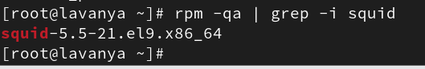
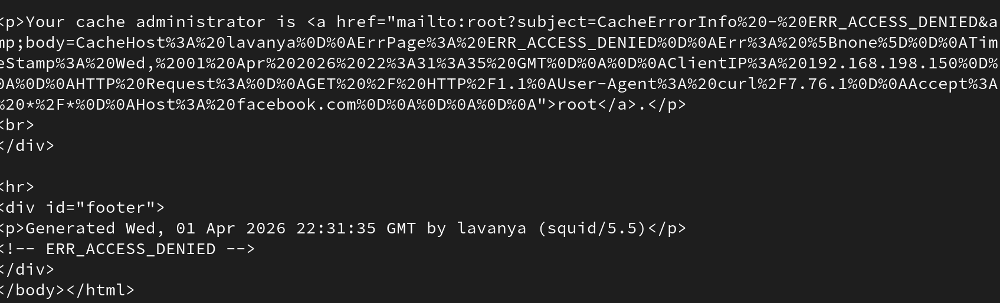
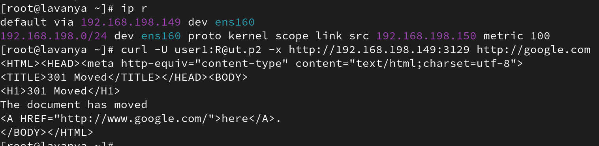
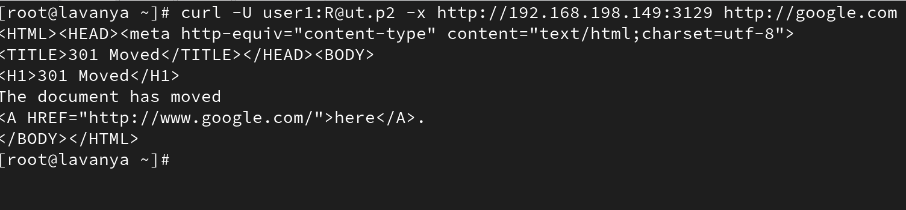
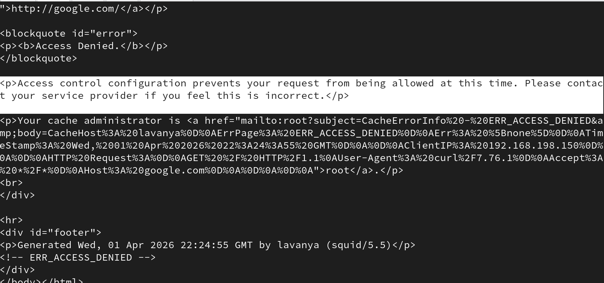
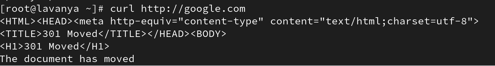
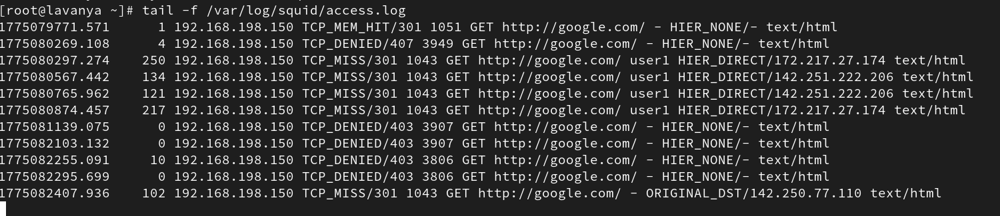

# Enterprise Squid Proxy Deployment.

This project demonstrates the deployment and configuration of an enterprise-level Squid proxy server.

## Architecture

Client → Squid Proxy → Internet

## Screenshots

### Squid Installation


### Blocked Website Test


### Allowed Website Test


### User Based Authentication


### Time Based Blocking


### Transparent Proxy Test


### Squid Access Logs


The proxy server is responsible for filtering traffic, enforcing authentication policies, and controlling web access.

## Features Implemented

* Squid proxy installation on RHEL 9
* Access Control Lists (ACL)
* Website blocking using external block list
* Allowed website list
* Proxy authentication using username and password
* Time-based access policy
* Transparent proxy using firewall NAT redirect
* Proxy log monitoring

## Lab Environment

Proxy Server: 192.168.198.149
Client Server: 192.168.198.150
Proxy Port: 3128
Authenticated Proxy Port: 3129

## Key Configuration Files

```
/etc/squid/squid.conf
/etc/squid/blocked_sites.txt
/etc/squid/allowed_sites.txt
/etc/squid/passwd
```

## Example Commands

Test proxy:

```
curl -x http://192.168.198.149:3128 http://example.com
```

Test authenticated proxy:

```
curl -U user1:password -x http://192.168.198.149:3129 http://google.com
```

Test transparent proxy:

```
curl http://example.com
```

## Logs

Squid access logs can be monitored using:

```
tail -f /var/log/squid/access.log
```

## Project Outcome

This project demonstrates enterprise proxy concepts including access filtering, authentication, and transparent proxy deployment on Linux systems.

Author
Anurag Utkarsh
Devops Engineer.
